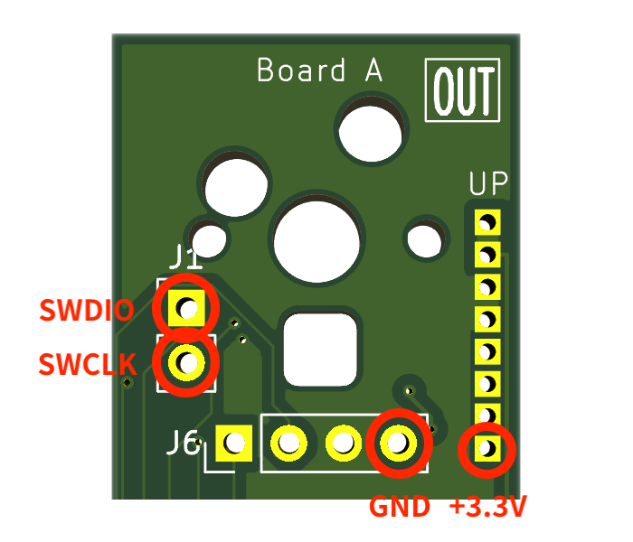
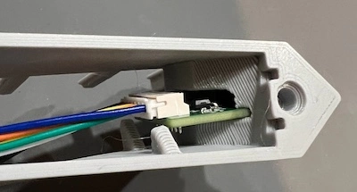
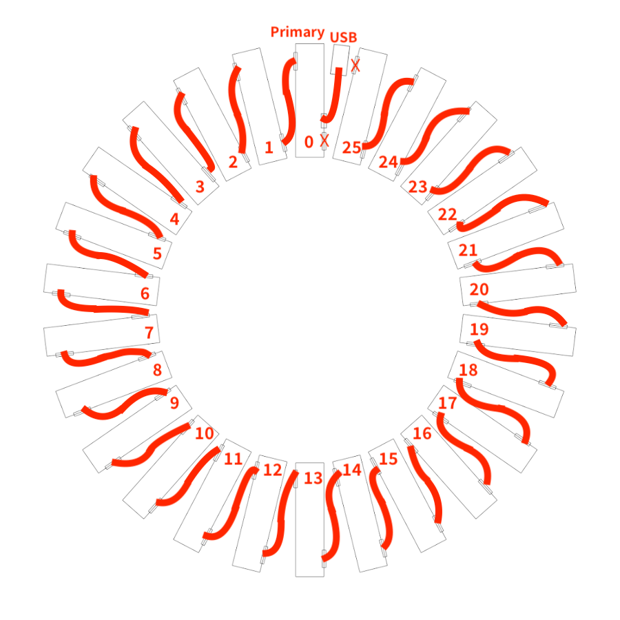

# Gboard double sided version

This directory contains the firmware and hardware design for Gboard double sided
version, which was released on **Oct 1, 2024**.

This is not an officially supported Google product.

## Contents

The directory structure is as follows:

-   case/ : STL files for case
-   board/ : KiCad schematics and PCB layouts
-   firmware/ : Firmware resources for STM32CubeIDE
-   gerber/ : Gerber data for PCB production and assembly

## Building Gboard double-sided Version

### Parts

-   Assembled A Type Board: 26 boards (incl. 1 primary board) - See BOM below
-   Assembled B Type Board: 26 boards (incl. 1 primary board) - See BOM below
-   USB Board: 1 board - See BOM below
-   Cable A; JST ZH 1.5mm pitch 8pin 100mm forward double head: 25 units
-   Cable B; JST ZH 1.5mm pitch 7pin 100mm forward double head: 1 units
-   Pin Header; 1x4 pin 2.54mm pitch 12+mm height,
    ([sample](https://akizukidenshi.com/catalog/g/g101382/)): 52 headers.
-   3D printed case: 26 pcs
-   Self tapping screw (M2 10mm): 52 pcs
-   Key switch (Cherry MX or compatible): 208 pcs.
-   Key caps (For Cherry MX switch): 208 pcs.

#### A Type Board BOM

| Reference | Description                         | Qty | Note               |
| --------- | ----------------------------------- | --- | ------------------ |
| R1-R2     | 0402(metric: 1005) Resistor 510 ohm | 2   |                    |
| R3-R4     | 0603(metric: 1608) Resistor 1K ohm  | 2   | Primary board only |
| J2-J3     | JST S8B-ZR                          | 2   |                    |
| J4        | JST S7B-ZR                          | 1   | Primary board only |
| U1        | STMicro STM32F042F4P6               | 1   |                    |
| SW1-SW4   | Kailh CPG151101S11-1                | 4   |                    |
| D1-D4     | OPSCO Optoelectronics SK6812MINI-E  | 4   |                    |
| D5-D8     | 0805(metric: 2012) Small Signal     | 4   |                    |
:           : Switching Diode                     :     :                    :
| C1        | 0402(metric: 1005) Capacitor 0.1uF  | 1   |                    |

The parts that are only on the primary board are not included in the BOM file
(in `gerber/` directory), so make sure that you choose one board to be the
primary board and solder in the primary board specific parts.

#### B Type Board BOM

Reference | Description                                     | Qty | Note
--------- | ----------------------------------------------- | --- | ----
R2        | 0402(metric: 1005) Resistor 510 ohm             | 1   |
SW1-SW4   | Kailh CPG151101S11-1                            | 4   |
D1-D4     | OPSCO Optoelectronics SK6812MINI-E              | 4   |
D5-D8     | 0805(metric: 2012) Small Signal Switching Diode | 4   |

#### USB Board BOM

Reference | Description                          | Qty | Note
--------- | ------------------------------------ | --- | ----
U1        | 1A/3.3V Regulator AMS1117-3.3        | 1   |
R1-R2     | 0402(metric: 1005) Resistor 5.1K ohm | 2   |
R3-R4     | 0402(metric: 1005) Resistor 22 ohm   | 2   |
R5        | 0402(metric: 1005) Resistor 1.5K ohm | 1   |
J1        | JST S7B-ZR                           | 1   |
J2        | USB Type-C 16pin connector           | 1   |
C1        | 0402(metric: 1005) Capacitor 10uF    | 1   |
C2        | 0402(metric: 1005) Capacitor 2.2uF   | 1   |
C3-C4     | 0402(metric: 1005) Capacitor 47pF    | 2   |

### Hardware

#### Step 1: Prepare 3d printed parts

The `case/` directory of this repository has STL files for the case. The case
consists of 26 parts (case00.stl - case25.stl). Each part has a number engraved
on the inside. For example, when assembling, you will insert the protrusion of
case 0 into the hole of case 1.

We also provide a jig (`case/jig.stl`) for soldering between the A type boards
and B type boards. Please print this too.

#### Step 2: Prepare PCB

**PCB Production and Assembly**

First, you need to build 26 A type boards and 26 B type boards, and one USB
board. You may be able to use existing gerber data, BOM, and CPL (positions)
from `gerber/` directory.

Board Type | Gerber         | BOM                | CPL
---------- | -------------- | ------------------ | ------------------------
A          | main_panel.zip | main_panel_bom.csv | main_panel_positions.csv
B          | sub_panel.zip  | sub_panel_bom.csv  | sub_panel_positions.csv
USB        | usb.zip        | usb_bom.csv        | usb_positions.csv

Prepared board data for the A type board and the B type board contains 9 boards
in a panel. So, you need to produce 3 panels to build 27 (26 required + 1 spare)
boards. You also need one USB board.

**Firmware upload**

Next, let's burn the prebuilt firmware.

Connect the following 4 pads, SWDIO, SWCLK, GND, and +3.3V with ST-LINK. You can
use
[STM32CubeProgrammer](https://www.st.com/ja/development-tools/stm32cubeprog.html)
to configure the device and to burn the prebuilt firmware. There's no connector,
just holes in the PCB so make sure you keep a secure connection while
programming the device.

Once the programmer establishes the connection with the A type board, you need
to write the `Option bytes`. Under the `User Configuration` section, you will
see the `BOOT_SEL` bit. You need to ensure the bit is unchecked before pushing
the `Apply` button.

Next, you will go to the `Erasing & Programming` section to burn the prebuilt
firmware, `firmware/prebuilt/mozc.elf`. Select the binary from the `Browse`
button, put `0x08000000` for the `Start address`, then press the `Start
Programming` button.

You need to burn the same settings and firmware into all the Boards A.

**Primary A Type Board Specific Modifications**

You need to choose one of the A type boards to be the primary A type board and
add three parts to it.

1.  J4 JST S7B-ZR connector header
2.  R3 0603 Resistor 1K ohm
3.  R4 0603 Resistor 1K ohm

**Construct the A/B Type Board Pair Modules**

You need to prepare 26 pairs of the A type board and B type board. They should
be paired as the following picture shows. Each `P Connector` and each `S
connector` should be connected using the 1x4 pin headers respectively.

Make sure that the `IN` side of the A type board and B type board face each
other.

Also, the distance should be adjusted to fit the case. It will help to print the
included jig STL to hold both boards while soldering the pin headers.

#### Step 3: Insert PCB to case

**Primary A/B Pair Module**

Connect the primary module and the USB board.

Insert the USB board into case 0.

**All Pair Modules**

Insert each paired module into a case. You need to ensure the A type board is
always placed on the bottom side.

#### Step 4: Connect the cases together

You need to connect all the `UP` socket and `DOWN` socket pairs. Please be
careful not to connect the same type of socket, i.e. `UP` and `UP`, or `DOWN`
and `DOWN` together. It will cause a short circuit and destroy the chips when
powered on. If you notice a smell or see smoke, disconnect the power
immediately. This may prevent damage to the boards.

The below picture shows the connections. Please make sure that module 0 and
module 25 are not connected to each other.

Note that this picture is simplified and doesn't reflect the 3d structure of the
keyboard. So, module 25 will be placed upside down.

You can use screws to keep the boards tightly connected.

### Firmware

#### Step 1: Environment setup

You need to install STMicroelectronics's official tools to develop STM32.

-   [STM32CubeIDE](https://www.st.com/en/development-tools/stm32cubeide.html) -
    Confirmed with 1.16.1.
-   [STM32CubeMX](https://www.st.com/en/development-tools/stm32cubemx.html) -
    Confirmed with 6.12.1.

Alternatively, you can use Visual Studio Code with the STM32 VS Code Extension,
STM32CubeMX, and STM32CubeCLT if your development environment is not on Windows.

-   [Visual Studio Code](https://code.visualstudio.com/) - Confirmed with
    1.93.0.
-   [STM32 VS Code Extension](https://marketplace.visualstudio.com/items?itemName=stmicroelectronics.stm32-vscode-extension) -
    Confirmed with 2.1.0.
-   [STM32CubeCLT](https://www.st.com/en/development-tools/stm32cubeclt.html) -
    Confirmed with 1.16.1. You will be asked to specify the path to the VS Code
    Extension. You may add `{ "STM32VSCodeExtension.cubeCLT.path":
    "/opt/ST/STM32CubeCLT_1.16.1" }` to `.vscode/settings.json`.

    You will need the
    [ST-LINK](https://www.st.com/ja/development-tools/st-link-v2.html) or
    something equivalent to upload the firmware.

#### Step 2: Compile and upload

**Steps for the STM32CubeIDE:**

1.  Launch STM32CubeIDE with `mozc-doublesided` directory as `workspace`.
2.  Start a project via `Start new project from STM32CubeMX file (.ioc)` to open
    a configuration dialog.
3.  Select `firmware/mozc-doublesided.ioc` as `STM32CubeMX .ioc file` and push
    `Finish` button to generated required resources.
4.  Apply patches. (See the following instructions)
5.  Set `Release` as the active project, from `Project > Build Configurations >
    Set Active > 2 Release`. `Debug` doesn't fit the available memory size.
6.  Build, from `Project > Build All`.

The built binary will be produced at `firmware/Release/firmware.elf`.

**Steps for the Visual Studio Code:**

1.  Open `firmware/mozc-doublesided.ioc` by STM32CubeMX and push the `GENERATE
    CODE` button. You may need to follow instructions if you are asked to
    install something required in the process.
2.  Launch VSCode and open the folder `firmware`.
3.  Apply patches. (See the following instructions)
4.  Select `Release` or `RelWithDebInfo` from the build presets. `Debug` doesn't
    fit the available memory size.
5.  `Build` from the status bar, or other user interfaces.

The built binary will be produced at `build/Release/firmware.elf`.

If you saw errors on linking the binary involving `STM32F042F6Px_FLASH.ld`, you
may need a patch to make it work with your installed toolchain.

Try `patch < STM32F042F6Px_FLASH.ld.diff`.

**Steps to apply patches:**

In the `firmware` directory, apply the `firmware.diff` patch to the generate
resources via the following command.

`$ patch -p1 < firmware.diff`

## License

See [LICENSE](../LICENSE) file in this directory.
